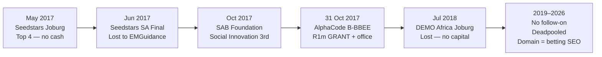

# CommuScore as blueprint for KasiCred: the $70k truth, the business model that died, and academic proof of the problem

> Generated 2026-09-24 · depth: deep · 53 sources · workspace: research/commuscore-blueprint/

## Executive summary

- **CommuScore is not a living rival — it is a corpse.** Founded 2017 (Sandton/Johannesburg) by Philile Mkhize and Priya (Thakoor) Mistry, it sold stokvel-admin software as a data pipe for alternative credit scores. Tracxn marks it **Deadpooled** (1 employee as of Apr 2026); Seedtable says “No longer operating”; `commuscore.com` is now an SA sports-betting SEO farm [1][2][3][4].
- **The famous “$70k raise” is a myth-shaped truth.** On **31 Oct 2017** they won **ZAR1,000,000 (~US$70k)** at AlphaCode’s B-BBEE pitch, funded by **Merrill Lynch SA + Royal Bafokeng Holdings**. Contemporaneous media calls it **grant funding**. Aggregators (Tracxn $70k / Seedtable $59k) mislabel it as a “Seed” equity round with Merrill Lynch as investor. That is the entire documented cap table [5][6][7][8].
- **Seedstars made them famous, not funded.** Joburg pre-selection May 2017 (top 4) → SA final June 2017 where **EMGuidance** won. The Swiss global prize (up to US$500k equity) never came. DEMO Africa Joburg 2018 also paid nothing [9][10][11].
- **Non-cash capital mattered:** AlphaCode BEE Centre of Excellence membership + free Sandton office at 2 Merchant Place. Use-of-funds pattern for that R1m class: platform build, skilled hires, laptops, BD — **founder runway, not scale capital** [5][12].
- **Business model (inferred, never priced publicly):** free group admin app → capture contribution/loan discipline → sell alt-score / credit identity B2B2C to banks (FirstRand, Standard Bank named as “partnering banks”). **No public price, tier, who-pays contract, or client volume ever appeared** [13][14][15].
- **Your TransUnion price list is not validated as public SA list pricing.** Archived TransUnion SA consumer retail (Aug 2020) was TrueCredit **R40.35/mo** or R321.80/yr; TrueIdentity R99/mo or R799/yr; once-off report R80.70. Your Trace R20.84 / Consumer Profile R55.58 / SME R457.01 / sub R21–R145 **do not match** public SKUs and may be B2B card rates or another bureau’s “Trace” (XDS markets Trace). Treat them as **unverified** until you have a TransUnion Direct / XDS commercial rate card [16][17][18].
- **Who wins in this market, who dies:** winners hold **rails** (M-Shwari/Fuliza on M-PESA) or lend to **formalised SMEs** (Merchant Capital >R17bn / ~70k SMEs; Lula) or sell **risk engines B2B into lenders’ LMS** (Tausi). Pure “trust graph → score” without a capital buyer dies — CommuScore’s exact failure mode [19][20][21][22][23].
- **Academic + institutional proof of your problem is strong:** hundreds of millions lack scorable history [24]; alternative/psychometric/email models can underwrite when bureau files are missing [24][25]; African SMEs blocked by missing bureaus/collateral [26][27]; SA stokvels ≈ **R49bn / 11.5m members** sit outside bureaus with real governance (constitutions, penalties) [28][29]. NCR itself published *Alternative Data Landscape in South Africa* (June 2021) [30].
- **POPIA s71 is a live landmine for a “trust score” used for credit.** Solely automated decisions with legal/substantial effect based on profiling of **credit worthiness / reliability / conduct** are banned unless contract exception or contestability + explanation of underlying logic. A Loan Ready badge **is** that class of decision [31][32].
- **Capital playbook for you:** the CommuScore path was **corporate BEE/grant track (R1m) + pitch circuit**, not VC. Current ladder bands: Seedstars International first ticket **US$150–350k** (avg $212k, B2B-heavy); Seedstars Africa Ventures **US$250k–$5m** (US$42m first close Dec 2024); UTF for university/alumni spinouts; **Kalon will not fund “ideas or prototypes.”** Food-and-fun hackathon teams never clear that filter [33][34][35][36][37].

**Bottom line for KasiCred:** copy CommuScore’s **problem and data wedge**, not their **product shape or capital story**. They proved a prize can buy 12 months of runway and then the company died because nobody bought the score. You sell the **shovel** (ledger + API into lender workflows), keep POPIA contestability in the product, and target B2B cheques — not consumer app vanity.

---

## Background & scope

**Question:** How did CommuScore build and fund a business closest to KasiCred (blockchain trust/credit ledger for informal SA vendors), and what evidence proves the informal credit-invisibility problem?

**Scope:** CommuScore product/founders/status; the ~$70k capital path; business model vs SA bureau pricing; NCR/NCA/POPIA; academic proof; competitors and corpses; hackathon→capital playbook. Out of scope: building KasiCred features, US FICO deep dives, protocol design.

**Assumptions:** `comscore.com` is **Comscore, Inc.** (US media measurement) — **not** CommuScore [38]. User-supplied bureau prices are anchors to validate. Time frame emphasis 2017–2026.

---

## 1. What CommuScore actually was

| Field | Fact | Sources |
|---|---|---|
| Legal name / brand | CommuScore (two m’s) | [1] |
| Founded | 2017, Johannesburg / Sandton, Gauteng | [2][4] |
| Founders | Philile Mkhize · Priya (Thakoor) Mistry | [2][8] |
| HQ | AlphaCode, 3rd Floor, 2 Merchant Place, Sandton 2196 | [12][39] |
| Product | Multi-tenant **stokvel / informal savings scheme admin app** (members, meetings, payments, loans, fines, Credit Request) used as behavioural data capture | [14][15] |
| Thesis | Informal schemes are disciplined; **reputation risk** drives contribution consistency — digitise that into credit identity | [1] |
| ICP | Stokvel members + informal micro-enterprises financially active but without bureau credit identity | [4][39] |
| Stated TAM | 800k registered stokvels / 11m contributors (company claim via NASASA) | [13] |
| Status (2026) | Deadpooled / closed / domain repurposed | [1][2][3][4] |

**Mapping to KasiCred:** CommuScore captured **group contribution and loan-repayment discipline**. KasiCred captures **buyer ratings of stall trade**. Both try to turn informal trust into a lender-facing number. CommuScore went B2B2C via stokvel software; KasiCred goes B2B2C via QR/WhatsApp reviews + on-chain integrity. Their death is your design constraint: **a score without a paying capital provider is a dead product.**

---

## 2. The $70k truth — how they actually got money

### 2.1 The only documented capital

On **31 October 2017**, four black-owned SA fintechs each won **R1,000,000** at AlphaCode’s pitching event with **Merrill Lynch South Africa** and **Royal Bafokeng Holdings**: CommuScore, Investsure, Cascade, Everest Ventures [5][8].

Contemporaneous Disrupt Africa: “Four black-owned South African fintech startups have secured ZAR1 million (US$70,000) each in funding from Merrill Lynch…” [8]. Ventureburn describes the programme as **grant funding** (R500k–R1m per business; R13m to 15 startups over two years) [5].

**What unlocked it:** a **5-minute pitch** in a 10-company field, judged on **revenue model, problem, differentiation, marketing plans** — not on revenue traction or a term sheet [5].

**Non-cash bundled:**
- AlphaCode **BEE Centre of Excellence** membership
- Free office at 2 Merchant Place, Sandton
- Business support services [5]

**How winners spent it (AlphaCode’s own pattern):** technology platform for annuity revenue, skilled hires, equipment (laptops), marketing/BD. That is **R1m = one full-time founder + MVP runway**, not growth capital [5].

### 2.2 What did *not* pay

| Path | Outcome | Sources |
|---|---|---|
| Seedstars Joburg (May 2017) | Top 4 with Invoiceworx, Empty Trips, Muzi → SA final | [9][10] |
| Seedstars SA final (June 2017) | **Lost** — EMGuidance took the Swiss slot (up to US$500k equity prize path) | [11] |
| DEMO Africa Joburg (July 2018) | Lost joint first to GetHosted and Loyal1; Morocco package was “resources worth over US$150k,” not a clean cheque | [11] |
| Later VC / angel / follow-on | **None documented.** Tracxn: 1 investor (Merrill Lynch). Seedtable: 1 round. Company deadpooled | [2][7][8] |

### 2.3 Aggregator mythology (why people say “seed $70k”)

| Source | Label | Amount | Date | Instrument (truth) |
|---|---|---|---|---|
| Ventureburn / Disrupt Africa | B-BBEE grant / award | R1m ≈ US$70k | 31 Oct – 6 Nov 2017 | **Grant / prize** |
| Tracxn | Seed | $70k | Nov 6, 2017 | Mislabelled equity “seed” |
| Seedtable | Seed · Merrill Lynch Lead | $59k | 1 Nov 2017 | FX-flattened mislabel |

**Mentor read:** nobody handed them $70k because “dad knows a guy.” They won a **corporate BEE grant competition** that had already paid out R13m to 15 startups. That is a **reproducible lane** — but it is prize money with judging criteria, not a relationship cheque. [5][6][7][8]

### 2.4 Capital timeline (reconstructed)



---

## 3. Business model — and the autopsy

### 3.1 Model (as evidenced)

```
Free admin tool for stokvel / eSusu / chama
        ↓  captures
Contribution discipline · attendance · loans · fines
        ↓  produces
Alternative credit score / "credit identity"
        ↓  sold (inferred) to
Banks / credit providers  →  "PARTNERING BANKS: FirstRand, Standard Bank"
```

Primary site (2018–2019 Wayback) never published price, tier, API fee, or who-pays terms. “Credit Request” existed as a product surface [14][15][13].

### 3.2 Why pure score products die (pattern match)

| Archetype | Example | Status | Moat |
|---|---|---|---|
| Stokvel-trust score SaaS | **CommuScore** | **Dead** | None — no capital buyer, $70k, no distribution |
| MCA / working capital | Merchant Capital, Lula | Live / scaled | Bank + card + bureau on **formalised** SMEs (R40–50k+/mo floors) |
| Telco / wallet credit | M-Shwari, Fuliza | Live / scaled KE | Owns rails + transaction exhaust; credit is a wallet feature |
| Mobile money in banked market | M-PESA South Africa | Stalled | ~70% banked + FICA KYC killed the unbanked beachhead (projected 10m users; ~100k by May 2011) |
| Alt-score → lender LMS | Tausi Africa | Operating | B2B risk engine inside loan systems |
| Consumer alt-score / repair | Fair Score (SA) | Pre-launch | Unproven — graveyard pattern |

Sources: [19][20][21][22][23][40][41]

**Who wins:** (a) owns payment/rails and prices credit as a feature, (b) funds formalised SMEs with digital exhaust, or (c) sells risk into licensed lenders.

**Why others die:** score without balance sheet or lender buyer; true cash-informal with no digital exhaust; mobile-money clones in banked markets; $70k-class seed with no regulated partner.

Academic side agrees: phone metadata is a **weak** substitute; informal financial institution (stokvel) behaviour is the better signal — the CommuScore thesis that **could not be monetised** [42][43].

---

## 4. Market pricing — your numbers vs the archive

### 4.1 What you gave us

| SKU (your list) | Your price | Validation |
|---|---|---|
| TransUnion Trace lookup | R20.84 excl VAT | **Unverified** on TransUnion public pages/Wayback. XDS markets a “Trace” SKU — may be the wrong bureau |
| TransUnion Consumer Profile | R55.58 | **Unverified** |
| TransUnion Business Dynamic Rating / SME Assessment | R457.01 | **Unverified** as that product name |
| Consumer subscription | R21/mo or R145/yr | **Contradicted** by public Aug-2020 retail |

### 4.2 What is actually documented (TransUnion SA consumer, Aug 2020 Wayback)

| Product | Price |
|---|---|
| TrueCredit | R40.35/month · R321.80/year |
| TrueIdentity | R99/month · R799/year |
| Credit Report & Score (once-off) | R80.70 |
| Annual Free Credit Report | Free 1×/year (NCA right) |

Sources: [16][17]

### 4.3 Competitive free floor (why B2C score is a trap)

- **Experian Up:** free consumer report + score (0–999) [18]
- **XDS Splendi:** free consumer report/score, unlimited [44]
- NCA: one free report per bureau per year [31]

**Implication for KasiCred unit economics:** do **not** sell vendors a score subscription. Consumer score is racing to free. The viable payer is the **lender / credit provider** at enquiry time (and/or platform SaaS into their LMS). Price against bureau enquiry SKUs (your R20–R80 consumer band and R400+ commercial band **after** you hold a real B2B rate card) [16][18][44][17].

### 4.4 Market structure (for the pitch)

- NCR registers **53–55 credit bureaus** and **8,218 credit providers** [45][46]
- Formal bureau files = **NLR + SACRRA + CIPC** (and property). Cash-only vendor trade is **not in the file** [47]
- NCR research library includes *Alternative Data Landscape in South Africa* (June 2021) and SME/informal credit studies — the regulator already knows the gap [30][48]

---

## 5. Regulation — POPIA will eat a naive “trust score”

| Rule | What it means for KasiCred | Sources |
|---|---|---|
| **NCA 34/2005 + NCR** | Operating as a **credit bureau / reseller bureau** requires NCR registration. If you sell “credit information” to lenders, you may be inside the wire | [45][49][50] |
| NCA purpose | Explicit mandate: accessible credit for low-income, historically disadvantaged, remote communities — your **policy tailwind** | [51] |
| **POPIA s71** | Solely automated decisions with legal/substantial effect based on profiling of **credit worthiness, reliability, conduct** are restricted. Contract exception **or** appropriate measures | [31][32] |
| POPIA s71(2)–(3) | Those measures must allow **representations** (contest) and disclose **sufficient information about the underlying logic** | [32] |
| POPIA ops | In force 1 Jul 2020 (grace to 30 Jun 2021). Information Officer registration required | [32][53] |
| Data shape | No GPS (good). But buyer phones in hash preimages + SQLite reviews = personal information under POPIA. Need retention/deletion/export | (code + [32]) |

**NCA s1 “credit information” definition** was not textually extracted this run (PDF body unreadable). Whether a community trust score is NCA “credit information” (triggering bureau rules) is an **open legal question** — get a 30-minute NCR/attorney read before you sell to a microlender [49].

**Product requirement you cannot skip:** if Loan Ready is used for credit decisions, ship **explain + contest** (why the score, how to dispute a review) — not a black-box badge.

---

## 6. Academic / institutional proof of the problem

### 6.1 Credit invisibility is real

- “Hundreds of millions of people in low-income economies do not have a credit or bank account because they have insufficient credit history for a credit score to be ascribed to them.” — Djeundje, Crook, Calabrese, Hamid (Edinburgh), *Expert Systems with Applications*, 2020 [24]
- Underbanked in emerging markets cannot supply collateral or ID required by banks — structural exclusion of cash traders — Mhlanga (UJ), *IJFS*, 2021 [25]
- African SMEs blocked by information asymmetry, missing collateral, perceived default risk, and **absence of credit bureaus** — Mpofu & Sibindi (UNISA), *JRFM*, 2022 [26]
- Policy recommendation: link formal + informal finance; SMEs should use **FinTech platforms** to access credit — same paper [27]

### 6.2 Alternative data can work when bureau files don’t

- Email + psychometric + demographic models reach accuracy **sufficient to underwrite** when conventional history is unavailable — Djeundje et al. [24]
- ML on alternative/public data reduces information asymmetry and adverse selection for thin-file borrowers — Mhlanga [25]
- Mobile money can stand in for bank-relationship history for SMEs where banking access is low — Tengeh & Talom, 2020 [52]
- **Counterweight:** phone-generated datasets have **real limits** in developing countries; informal financial institution (stokvel/susu) data is the better complementary source — UCT 2021 [42]. Informal merchants still cash-dominant → weak digital exhaust — Springer 2025 fintech loan-book study (Lesotho/Tanzania) [43]

### 6.3 SA informal trust infrastructure already exists

| Signal | Number | Source |
|---|---|---|
| Stokvel economic weight | ≈ **R49bn**, **11.5m members** (SA pop. context ~57m at study time) | [28] |
| Cape Town grocery stokvels | 10–30 members, ZAR200–1500/mo, **85% enforce penalties** via constitutions, 95% women-led | [29] |
| Historic trust-as-collateral | Social reputation + reciprocity as primary security (African informal credit systems) | [54] |
| Even banked households | Keep informal instruments for flexibility, speed, trust, crisis | [55] |
| SADC digital FS | Only **27%** of SADC adults use digital financial services — thin digital trails | [40] |

**Gap (honest):** no peer-reviewed paper found that measures **% of SA informal street vendors with empty bureau files**. You can still cite FinScope / NCR alternative-data work for the adjacent claim, and run a 30-vendor field check as primary evidence for your paper [30][40][48].

---

## 7. Competitive differentiation sentence (Phase 2 discipline)

Fill this in with a **real** structural constraint Z — or discard the idea as commodity:

> “Unlike **CommuScore** (stokvel SaaS → score, dead 2026) and **Merchant Capital/Lula** (formal SME MCA with bureau+bank statements), **KasiCred** produces a lender-facing trust ledger for **cash-only street vendors with no bank/card trail** because of **buyer-attested ratings hashed on Celo + POPIA-contestable scores sold as an API into microlender workflows** — not a consumer app and not a free score.”

If Z is just “we use blockchain,” a judge yawns. Z must be: **tamper-evident ratings + no vendor smartphone required (QR/WhatsApp) + relayer so buyers never touch crypto.**

---

## 8. Capital playbook — “food and fun” vs the ladder

### 8.1 The CommuScore path (reproducible)

1. **Live product before the cheque** — Wayback shows they were already operating from AlphaCode’s address in Aug 2017, before the R1m [39].
2. **Pitch circuit for visibility** (Seedstars, DEMO) — low cash conversion, high network [9][10][11].
3. **Corporate BEE / grant track for cash** — AlphaCode × Merrill Lynch × Royal Bafokeng, R1m grants to four fintechs [5][8].
4. **Then die** if no lender buyer appears.

### 8.2 Current SA/SSA ladder (use this, not 2017 folklore)

| Vehicle | Cheque / role | Fit for KasiCred | Sources |
|---|---|---|---|
| Corporate innovation / BEE pitch (AlphaCode-class) | R500k–R1m grant class | **Best first cash** if the programme still runs | [5] |
| Seedstars International | First **$150–350k** (avg $212k), follow-on to $500k, 3–5%, **52% pre-seed, B2B** | After demo + B2B narrative | [34] |
| Seedstars Africa Ventures I | **$250k–$5m**; US$42m first close Dec 2024 (AfDB, EIB Global) | Later | [33] |
| Seedstars side prizes | $10k grants / $50k programme value | Fillers, not the plan | [56][57] |
| UTF I / UTF II / **UTF Seed Fund (2025)** | University spinouts & **alumni-led** post-pilot | **If** WeThinkCode_ / university nexus qualifies | [36] |
| SA SME Fund | **Fund-of-funds only** — do not apply as a founder | Go through their VC managers | [58] |
| Kalon Venture Partners | Tech + **revenue-producing**; explicitly **not “ideas or prototypes”** | The food-and-fun filter | [37] |
| Angels (Jozi Angels etc.) | Not captured this run | Open | — |


## 8. Comparison table — KasiCred vs the field

| Option | Who pays | Data moat | Capital need | Survival odds | Sources |
|---|---|---|---|---|---|
| **CommuScore (2017)** | Lenders (inferred) | Stokvel contribution history | Grant-only | **0 — dead** | [1][2][13] |
| Merchant Capital / Lula | SME borrower fees/interest | Bank + card + bureau | Balance sheet | High (formal SME) | [19][20] |
| M-Shwari / Fuliza | Borrower | M-PESA rails | Telco-scale | High (KE rails) | [21] |
| Tausi Africa | Licensed lenders (LMS) | Alt data engine | B2B sales | Operating | [22] |
| Fair Score | Consumer (likely) | Alt score + repair | Unproven | Pre-launch risk | [23] |
| **KasiCred (target)** | Microlenders / MFIs / banks (API + proof) | Buyer ratings + on-chain integrity | Grant + B2B pilot | **Only if B2B** | — |

---

## 9. Ruthless implications for KasiCred (what to change before the next pitch)

1. **Stop pitching “Google Reviews for spaza shops.”** Pitch: **thin-file trust ledger + lender API** for cash-informal SMEs — the NCR-named alternative-data gap [30][48].
2. **Kill B2C score subscriptions.** Experian Up / XDS Splendi are free. Lender enquiry pricing is the model [18][44].
3. **Redeploy the contract with `onlyRelayer` before any demo that claims integrity.** Your own README admits the live contract is the insecure one.
4. **POPIA s71 product surface:** score explanation + human contest path. If you can’t explain the score, you cannot sell it to a regulated lender [31][32].
5. **Fix the unweighted star score.** Two mates × 5★ = Loan Ready is not credit. Minimum: review volume floor, recency decay, maybe stokvel-style penalty history later [28][29].
6. **Primary research for your paper:** 30–50 vendors, show % with no bureau file / no formal loan — fills the academic gap and is demo gold [24][28].
7. **Capital plan:** corporate/BEE + university/UTF first R100–R300k-equivalent runway → one paid microlender pilot → Seedstars International B2B band ($150–350k) [5][34][36].
8. **Shovel framing:** revenue line items should look like (a) API per enquiry, (b) PDF proof export for lenders, (c) LMS integration — not app installs.

---

## Open questions

1. **NCA s1 definition of “credit information”** — extract from the Act PDF; decide if KasiCred must register as a credit bureau/reseller. *Highest legal priority.*
2. **Current TransUnion SA / XDS / Experian B2B schedule of fees** — your R20.84 / R55.58 / R457.01 numbers remain unverified; get a sales rate card before you put them in a pitch deck again.
3. **AlphaCode / Merrill Lynch (BofA) grant terms** — grant vs prize instrument; whether the programme still exists in a successor form (RMB/AlphaCode, BEE Centre of Excellence).
4. **Founder post-mortem** — Philile Mkhize / Priya Mistry on why stokvel SaaS never closed a lender deal (2019–2023). Not found in public web.
5. **SA street-vendor thin-file rate** — no peer-reviewed % found; generate your own field data.
6. **UTF Seed Fund eligibility** for WeThinkCode_ teams (alumni-led vs university IP).
7. **CommuScore pricing/contracts** — never public; FirstRand/Standard Bank “partnering banks” status unconfirmed as paying customers.

---

## Sources

[1] CommuScore LinkedIn company page (product self-description) — https://www.linkedin.com/company/commuscore?originalSubdomain=za (accessed 2026-09-24)

[2] Tracxn — CommuScore (Deadpooled, $70K, 1 FTE Apr 2026) — https://www.tracxn.com/d/companies/commuscore/__fjW1paZSAKRZFb88hEgAbMM0fUFYpyvKttncMYfb6G4 (updated 2026-07-30, accessed 2026-09-24)

[3] commuscore.com (live 2026 — sports betting affiliate, domain repurposed) — https://commuscore.com (accessed 2026-09-24)

[4] Seedtable — CommuScore (Seed $59K, “No longer operating”) — https://seedtable.com/companies/commuscore (updated 2026-08-21, accessed 2026-09-24)

[5] Ventureburn — Merrill Lynch, Royal Bafokeng awards R4m to four black fintech startups (grant language, BEE Centre, office, use-of-funds) — https://ventureburn.com/2017/11/merrill-lynch-royal-bafokeng-awards-r4m-four-black-fintech-startups/ (published 2017-11-05, accessed 2026-09-24)

[6] Ventureburn — Four black-owned fintech startups win R1m AlphaCode pitching event (31 Oct 2017) — https://ventureburn.com/2017/11/four-black-owned-fintech-startups-win-r1m-alphacode-pitching-event/ (published 2017-11-01, accessed 2026-09-24)

[7] Tracxn — CommuScore funding and investors ($70K Seed, Merrill Lynch) — https://www.tracxn.com/d/companies/commuscore/__fjW1paZSAKRZFb88hEgAbMM0fUFYpyvKttncMYfb6G4/funding-and-investors (accessed 2026-09-24)

[8] Disrupt Africa — SA fintech startups secure $70k each from Merrill Lynch (ZAR1m, four startups) — https://old.disruptafrica.com/2017/11/06/sa-fintech-startups-secure-70k-each-from-merrill-lynch/ (published 2017-11-06, accessed 2026-09-24)

[9] Disrupt Africa — 4 Johannesburg startups advance to Seedstars SA final — https://old.disruptafrica.com/2017/05/30/4-johannesburg-startups-advance-to-seedstars-sa-final/ (published 2017-05-30, accessed 2026-09-24)

[10] Disrupt Africa — Seedstars World picks 3 wildcard startups for SA final — https://old.disruptafrica.com/2017/06/28/seedstars-world-picks-3-wildcard-startups-for-sa-final/ (published 2017-06-28, accessed 2026-09-24)

[11] Disrupt Africa — 2 teams winners at DEMO Africa event in Joburg (CommuScore lost) — https://old.disruptafrica.com/2018/07/04/2-teams-winners-at-demo-africa-event-in-joburg/ (published 2018-07-04, accessed 2026-09-24)

[12] Ventureburn — Top 10 Seedstars South Africa finalists (EMGuidance win context) — https://ventureburn.com/2017/07/top-10-seedstars-south-africa-finalists/ (published 2017-07, accessed 2026-09-24)

[13] Wayback — CommuScore About (stokvel model, TAM, partnering banks, funders) — https://web.archive.org/web/20180817174130/http://commuscore.com/about/ (capture 2018-08-17, accessed 2026-09-24)

[14] Wayback — CommuScore homepage (admin tool features, Credit Request) — https://web.archive.org/web/20180203175018/https://commuscore.com/ (capture 2018-02-03, accessed 2026-09-24)

[15] Wayback — CommuScore Services (Manage group / Meetings / Credit identity) — https://web.archive.org/web/20190405084136/http://commuscore.com/services/ (capture 2019-04-05, accessed 2026-09-24)

[16] Wayback — TransUnion SA /products (TrueCredit/TrueIdentity/once-off prices Aug 2020) — https://web.archive.org/web/20200811183904/https://transunion.co.za/products (capture 2020-08-11, accessed 2026-09-24)

[17] Wayback — TransUnion SA product catalogue (no Trace/Consumer Profile/SME Assessment SKUs on public list) — https://web.archive.org/web/20200803090835/https://www.transunion.co.za/ (capture 2020-08-03, accessed 2026-09-24)

[18] Experian SA — free credit report and score on Up — https://www.experian.co.za/consumer/my-free-credit-check-and-your-free-credit-report (accessed 2026-09-24)

[19] Merchant Capital — SME funding eligibility (R50k+/mo, 12 months, R17bn / ~70k SMEs) — https://www.merchantcapital.co.za/ (accessed 2026-09-24)

[20] Lula (ex-Lulalend) — SME funding criteria (1+ year, R40k+/mo, credit score) — https://lulalend.co.za/ (accessed 2026-09-24)

[21] Wikipedia — M-Pesa (M-Shwari, Fuliza; M-PESA SA failure metrics) — https://en.wikipedia.org/wiki/M-Pesa (accessed 2026-09-24)

[22] Springer — Tausi credit risk scoring engine (LMS-embedded alt data) — https://link.springer.com/chapter/10.1007/978-3-031-73110-5_5 (published 2024-11-05, accessed 2026-09-24)

[23] Fair Score South Africa (pre-launch alt score) — https://fairscore.co.za/ (accessed 2026-09-24)

[24] Djeundje, Crook, Calabrese, Hamid — “Credit scoring using alternative data” / email+psychometric models — Expert Systems with Applications — https://doi.org/10.1016/j.eswa.2020.113766 (published 2020-12, accessed 2026-09-24)

[25] Mhlanga — ML credit risk with alternative data (emerging markets) — IJFS 9(3):39 — https://doi.org/10.3390/ijfs9030039 (published 2021-07, accessed 2026-09-24)

[26] Mpofu & Sibindi — African SME access to finance / credit bureaus gap — JRFM 15(6):270 — https://doi.org/10.3390/jrfm15060270 (published 2022-06, accessed 2026-09-24)

[27] Mpofu & Sibindi — policy: link formal/informal finance, FinTech for credit — https://doi.org/10.3390/jrfm15060270 (published 2022-06, accessed 2026-09-24)

[28] Bophela & Khumalo — Stokvels R49bn / 11.5m members — Problems and Perspectives in Management 17(4) — https://doi.org/10.21511/ppm.17(4).2019.03 (published 2019, accessed 2026-09-24)

[29] Lukwa, Wayas, Lambert & Alaba — Cape Town grocery stokvels (constitutions, penalties, contribution bands) — https://doi.org/10.1016/j.jneb.2026.03.013 (published 2026, accessed 2026-09-24)

[30] NCR — *Alternative Data Landscape in South Africa* (June 2021) + research library — https://www.ncr.org.za/index.php/publications/research-reports (published 2021-06 / catalogue accessed 2026-09-24)

[31] National Credit Act 34 of 2005 (NCR establishment; accessible credit mandate; credit information regime) — https://www.gov.za/documents/national-credit-act (accessed 2026-09-24)

[32] POPIA s71 — automated decision-making (credit worthiness profiling; contest + logic) — https://popia.co.za/section-71-automated-decision-making/ (text POPIA 4 of 2013; posted 2019-09-20, accessed 2026-09-24)

[33] Seedstars — Africa Ventures I $42m first close (AfDB, EIB Global) — https://www.seedstars.com/content-hub/newsroom/africa-investment-forum-2024-market-days-seedstars-africa-ventures-i-announces-42m-first-close/ (published 2024-12-06, accessed 2026-09-24)

[34] Seedstars International Ventures — terms (first $150–350k, avg $212k, 52% pre-seed, B2B) — https://www.seedstars-international.vc/ (accessed 2026-09-24)

[35] Disrupt Africa — Seedstars $100m Africa fund launch context (2019) — https://old.disruptafrica.com/2019/04/08/seedstars-to-launch-100m-venture-fund-for-african-tech-startups/ (published 2019-04-08, accessed 2026-09-24)

[36] University Technology Fund (UTF I / UTF II / UTF Seed Fund 2025) — https://utfund.co.za/ (accessed 2026-09-24)

[37] Kalon Venture Partners — apply for funding (no ideas/prototypes) — https://www.kalonvp.com/entrepreneur/apply-for-funding/ (accessed 2026-09-24)

[38] Comscore, Inc. (US media measurement — NOT CommuScore) — https://www.comscore.com/ (accessed 2026-09-24)

[39] Wayback — CommuScore homepage (AlphaCode HQ, live product pre-grant) — https://web.archive.org/web/20170815034607/https://commuscore.com/ (capture 2017-08-15, accessed 2026-09-24)

[40] FinMark Trust — FinScope informal market; 27% SADC digital FS — https://www.finmark.org.za/ (accessed 2026-09-24)

[41] Tracxn competitor rank / deadpool context — https://www.tracxn.com/d/companies/commuscore/__fjW1paZSAKRZFb88hEgAbMM0fUFYpyvKttncMYfb6G4 (accessed 2026-09-24)

[42] UCT SIT Showcase 2021 — alternative credit scoring for informal financial institutions (Njuguna & Rivett) — https://showcase.sit.uct.ac.za/event/showcase-2021/an-alternative-credit-scoring-system-for-members-of-informal-financial-institutions60 (published 2021, accessed 2026-09-24)

[43] Springer — informal merchant credit scoring limits (cash-dominant; 793k transactions study) — https://link.springer.com/article/10.1007/s44230-025-00105-6 (published 2025-07-02, accessed 2026-09-24)

[44] XDS — customer solutions / Splendi free consumer score — https://www.xds.co.za/customer-solutions/ and https://www.xds.co.za/ (accessed 2026-09-24)

[45] NCR — homepage counters (53 bureaus, 8218 credit providers) — https://www.ncr.org.za/ (accessed 2026-09-24)

[46] NCR — register of credit bureaus (TransUnion NCRCB4, XDS NCRCB5, …) — http://www.ncr.org.za/register_of_registrants/registered_cb1.php (accessed 2026-09-24)

[47] XDS — what we do (NLR + SACRRA + CIPC report composition) — https://www.xds.co.za/what-we-do/ (accessed 2026-09-24)

[48] NCR — SME/informal credit research titles (2008–2013) — https://www.ncr.org.za/index.php/publications/research-reports (accessed 2026-09-24)

[49] NCR — Registrations & Compliance (credit bureau / reseller registration) — https://www.ncr.org.za/index.php/departments/registrations-compliance (accessed 2026-09-24)

[50] NCR — Credit Bureau Compliance — https://www.ncr.org.za/index.php/departments/compliance-credit-bureau (accessed 2026-09-24)

[51] NCR — NCA mandate on historically disadvantaged / low income / remote communities — https://www.ncr.org.za/ (accessed 2026-09-24)

[52] Tengeh & Talom — mobile money and SME inclusive finance (Douala) — https://doi.org/10.3390/joitmc6040163 (published 2020-12, accessed 2026-09-24)

[53] Information Regulator South Africa — Information Officer registration — https://www.inforegulator.org.za/ (accessed 2026-09-24)

[54] Opara — historical African informal credit (trust/reciprocity as security) — https://doi.org/10.37745/ijhphr.13/vol14n12836 (published 2026, accessed 2026-09-24)

[55] Lappeman, Nordoff, Daly & Cheteni — formal vs informal financial instruments in SA — https://doi.org/10.1108/ijbm-11-2025-0959 (published 2026, accessed 2026-09-24)

[56] Disrupt Africa — Seedstars Africa Summit DOEN $10k prize / readiness programme — https://old.disruptafrica.com/2019/11/26/3-startups-to-pitch-for-10k-doen-land-restoration-prize-at-seedstars-africa-summit/ (published 2019-11-26, accessed 2026-09-24)

[57] Disrupt Africa — Seedstars Lausanne side prizes (Iyeza $10k Gates; Schoolap $50k programme) — https://old.disruptafrica.com/2019/04/08/seedstars-to-launch-100m-venture-fund-for-african-tech-startups/ (published 2019-04-08, accessed 2026-09-24)

[58] SA SME Fund — fund-of-funds, no direct SME cheques — https://sasmefund.co.za/ (accessed 2026-09-24)

[59] Seedstars World — CommuScore startup profile 42860 — https://www.seedstarsworld.com/startup/42860/ (accessed 2026-09-24)

---

### Source quality note

Primary/most reliable: Wayback of CommuScore’s own site [13][14][15][39], TransUnion product pages [16][17], NCR/gov.za [30][31][45]–[51], POPIA text [32], peer-reviewed DOIs [24]–[29][42][43][52][54][55], company sites for living competitors [18]–[20][22][23][33][34][36][37][40][44][58].

Contemporaneous media (high for 2017 facts): Ventureburn / Disrupt Africa [5][6][8]–[12].

Aggregators (use for status/cap table pattern, not instrument labels): Tracxn [2][7][41], Seedtable [4].

`comscore.com` is a different company [38].
