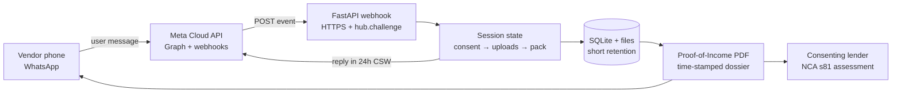

# GKHACK26 72-hour battle plan: BUILD FOR USE, WhatsApp without BSP, proof-of-income (not a credit score)

> Generated 2026-09-24 (Thursday) · depth: standard · 58 sources · workspace: research/gkhack26/
> Event: **Geekulcha Annual Hackathon 2026** · **25–27 Sep 2026** · **BCX Centurion** + virtual · Powered by Telkom
> **UPDATED 2026-09-24 17:14** from organiser email `sonke@geekulcha.dev` (15 Sep 2026, fwd. Khatisani → Nyaks)

## Executive summary

- **Theme (verbatim):** “**2026 THEME: BUILD FOR USE** — Don’t just build to impress, build to be used. Every solution must be genuinely ready for real-world deployment: with identified users, a validated problem, security-by-design, a sustainability plan, and measurable impact.” Judge test: “**Would a real user trust and use this?**” [1][2]
- **Your track is clean:** sub-theme “**Kasi and Street Economy** — Empower township businesses and informal traders through digital innovation.” KasiCred’s informal-vendor POI product traces to this in one sentence [3].
- **Selection PPT is already past** (deadline **25 Aug 2026 23:59**; registration closed; teams already selected). Public weekend deliverable rules (video length, repo, SDKs, rubric) are **not published** — they live in Sonke login / selection email. **Do that tonight.** [4][5][6]
- **Sponsors (corrected):** title **Telkom** (FutureMakers) + co-host **CPSI**; landing strip also CompTIA, UNISA, Queers Code, Tech Horizons. **LinkedIn (Geekulcha) adds BBD and Boxfusion as Silver.** No mandatory sponsor SDK/API on the public brief. Mentors skew **cybersecurity** (Steve Jump et al.) + AI — score **security-by-design**, not logo-slapping [7][8][9].
- **No BSP is officially fine.** Meta **WhatsApp Cloud API** is a true direct path (Meta App + Messaging account + Graph API + webhooks). No Solution Partner required. Do **not** use Baileys / whatsapp-web.js / venom — Meta prohibits unauthorized third-party tools; those libs self-document ban risk [10][11][12][13].
- **Demo cost is ~R0 this weekend** if replies stay inside the 24h customer-service window (non-template free since Nov 2024). Cloud API auto-provisions a **test number** with relaxed limits. Service-message billing starts **1 Oct 2026** (after the hack) [14][15][16].
- **Proof-of-income ≠ credit score is the legally correct reframe.** NCA credit-provider threshold is **R0** (any lending needs NCR). Credit-bureau trigger is *compiling and issuing consumer credit information for payment as a business*. Income **is** consumer credit information (s70) **if** you bureau it — so ship a **vendor-owned evidence pack**, not a Loan Ready score. POPIA: income is **ordinary** PI (not special), but you need s18 notice + consent + minimality + short retention [17][18][19][20][21].
- **NCA actually helps informal POI:** s78(3) counts income “regardless of source, frequency or regularity”; s1 defines **stokvel**; s70(2)(h) forbids negative inference from thin files [22][23][24].
- **72h product:** WhatsApp s18 notice + consent → photo of till slips / bank/stokvel records / affidavit / buyer attestations → time-stamped **Proof-of-Income dossier** (PDF) for the vendor or a consenting lender underwriting under s81 — **no score, no bureau file** [25].
- **Cold-machine rule still applies** even though the public brief omits it (DoubleZ lesson): fresh clone → `pip install` → env sample → API up → WhatsApp webhook verify → demo path in ≤10 minutes from a clean window.

---

## 0. Organiser email digest (15 Sep 2026) — Phase 0 hard facts

Source: `sonke@geekulcha.dev` “[READ EVERYTHING] Preparing for GKHack26”, issued by **Tiyani Nghonyama**, Lead Facilitator. Forwarded by Khatisani Mongwe. [E1]

### Logistics (non-negotiable)

| Item | Fact |
|---|---|
| Venue | **BCX Centurion, 1266 South Road, Centurion 0157** — huge white building, escalators to **1st floor** registration |
| Window | **Fri 25 Sep 15:00 → Sun 27 Sep 15:30** (GCal block 14:00–16:00 is travel/padding) |
| Arrive | **From 14:00** (registration + lunch). Best seats + goodies = early |
| Gate | **ID / Driver’s Licence / Passport** — name on list, strict security |
| Entrance fee | **Donation** (clothes, sanitary towels, food cans, books, gadget) — 2014 tradition |
| Stay | **No accommodation.** Nap on bean bags → bring a **blanky** |
| Day 2/3 | **Toiletries + change of clothes** (shower at venue) |
| Power/WiFi | Provided — **bring your own cables** |
| Food | Provided all weekend (water, **Red Bull**, coffee) |
| Transport | **Not provided.** Motivation letter: `nick@geekulcha.dev` + team student numbers. Taxi rank behind BCX · Gautrain bus at BCX · e-hailing fine |
| Virtual switch | Email organisers with **team name** if you bail onsite |

### Competition + judging (from the email)

- **150 teams, continental.** Kenya “tech war” vs SA; Botswana; Malawi.
- Judging factors: **innovation · business · security · design** — *and* tech. “Never undermine a challenge… make business sense.”
- **Judges read the project overview and everything** — plain language wins.
- **“Use of AI is not impressive.”** They want sense of reality and post-hack usability. Kill “AI-powered” copy tonight.
- **Project overview must carry real-life stories** — authenticity beats buzzwords.
- **BRAND NEW: Quantum Tech = 5 bonus points.** Team must **explain / implement** the technologies.
- **Sonke** will load **schedule + judging criteria by Friday**. Keep it open as a tab.
- **Prizes:** cash for **top 3** + **opportunity for support from Telkom** (last year’s winners got more for high-potential projects) + international career partnerships.
- Powered by **Telkom FutureMakers**, co-hosted with **CPSI**.

### Quantum Tech — ruthless allocation (5 pts)

| Move | Hours | Points realism | Verdict |
|---|---|---|---|
| Full quantum ML / optimisation product | 15h+ | Fake depth in 72h | **CUT** |
| Slide “we considered quantum” | 0.5h | Won’t score “implement” | Weak |
| **Honest mini-implementation** | **≤2h** | Hits “explain / implement” | **DO — only if POI demo is green** |
| Quantum after POI is still broken | — | Main criteria >> 5 pts | **0 pts is correct** |

**Recommended mini-implementation (security-flavoured, not theatre):**
1. **Implement:** Qiskit (Aer simulator is fine) measures a few qubits → hex entropy stamped into the PoI pack as `attestation_nonce` (optional colab/notebook + 20 lines Python in `pack.py`).
2. **Explain (1 slide, architecture):** “Tamper-evident income packs use SHA-256 over evidence + consent log. Entropy for pack IDs from quantum RNG simulator (Qiskit). PQC path: NIST ML-DSA signatures when we sign packs for lenders — classical hash alone is not the long-term integrity story under Grover.”
3. **Never say:** “We are a quantum company.” Judges and security mentors will eat that.

**Hard cut-off:** if WhatsApp POI path is not demoing by **Sat 12:00**, quantum gets **zero hours**.

### Phase 0 checklist (email-complete)

- [ ] ID packed · donation item packed · blanky · toiletries · cables · weather layer  
- [ ] Transport plan to BCX (taxi / Gautrain / e-hailing) — leave buffer for 14:00 rego  
- [ ] Sonke open + Friday load of **judging criteria + schedule**  
- [ ] Team name confirmed (needed if anyone switches virtual)  
- [ ] Project overview **story-first** draft (spaza owner, landlord/microlender, 4-minute WhatsApp POI)  
- [ ] All “AI-powered / credit score / Loan Ready” language deleted from deck + README  
- [ ] Meta Cloud API test number + webhook still green tonight  

---

## Background & scope

**Question:** What does GKHACK26 require, and what is the fastest legal path to a WhatsApp **proof-of-income** demo for informal SA vendors **without BSP/middleman**?

**In:** official brief, sponsors, WhatsApp Cloud API vs unofficial, POPIA/NCR framing, 72h ship plan. **Out:** production App Review, credit-model design, writing application code in this report.

**Assumptions:** user-stated dates 25–27 Sep 2026 confirmed on the official page; frame is **POI attestation, not credit scoring**; KasiCred FastAPI stack is the starting code.

---

## 1. Hackathon Framework — Phase 0 (Brief Compliance Gate)

### Problem/theme word for word

> “**2026 THEME: BUILD FOR USE** / Don't just build to impress, build to be used.”
> Kasi track: “**Empower township businesses and informal traders through digital innovation**.”

**One-sentence trace (must survive a judge):**  
*KasiCred helps informal township traders prove income with WhatsApp-collected trade evidence so a real lender or landlord can trust them — built to be used, not demoed.*

If you cannot say that without the words *credit score*, *AI*, or *blockchain* in the first breath, you have not framed it yet.

### Mandatory deliverables (public)

| Artefact | Status | Notes |
|---|---|---|
| Sonke team profile + members | Check tonight | KEY REQUIREMENT |
| PowerPoint: Problem Statement · Solution · TRL 3 · Technological Architecture · User Journey Story · Go-to-market | Due **25 Aug 2026 23:59** (selection) | Should already be submitted if you’re in |
| Video length | **Not published** | Confirm in Sonke/email |
| Repo structure | **Not published** | Assume clean public/private repo + README anyway |
| Required SDKs | **None published** | No Telkom/BBD API mandate on public page |
| Deploy link / demo video | **Not published** | Still ship a URL — cold-machine habit |
| On-site “entrance fee” | Donation (sanitary/food/clothes/books) | Logistics only |

**Disqualification risks (inferred from absence + Geekulcha norms):**
1. Missing Sonke team profile
2. Sunday demo that is slides-only (theme demands deployable/useable)
3. Looking like unlicensed credit scoring / unregistered bureau (NCA s54 stop-notice / s157C offence) [18][26]
4. Unofficial WhatsApp client in a “production” pitch (ToS) [12][13]

### Cold-machine check (tonight + Sunday freeze)

Someone outside the team must, from a fresh window:
1. Open the deploy URL or clone the repo  
2. Run `cp .env.example .env` + one start command  
3. Hit `/` and `/docs`  
4. Watch a WhatsApp (or WhatsApp-sim) POI flow complete  
5. Download the PDF evidence pack  

**Past failure this exact way:** DoubleZ lost placement on a broken Drive permission; WiFiGuard showed one contributor because the team cloned instead of forked. Fork if required. Fix permissions **before** Sunday 10:00.

### Sponsor tech: load-bearing or bolted?

Public brief: **no mandatory SDK**. Telkom is title sponsor without published API track; BBD is Silver (LinkedIn) without a GKHack26 build mandate [7][8][9].

**Rule:** if a Telkom/BBD/CompTIA surface appears in the Sonke pack, it must be **load-bearing** (e.g. delivery/notification, identity, connectivity) or you cut it. A logo on a slide is a tell.

---

## 2. Phase 1 — Idea stress test (proof-of-income frame)

| Test | Verdict |
|---|---|
| 1. One-sentence (non-technical judge, 10s) | **PASS** if you say “proof of income on WhatsApp for street traders,” **FAIL** if you say “trust score / Loan Ready / blockchain ledger.” |
| 2. AI causality | N/A this weekend unless Vulavula/Gemma is the product. Do not bolt AI for points. Theme is **use**, not model novelty. |
| 3. Framework anchor | **POPIA** (ss 10–18, 26) + **NCA** ss 40/43/70/78/81/157C + informal economy (stokvel s1). Name them explicitly. |
| 4. Doubt-reduction | Keep: WhatsApp Cloud API (official), POPIA notice in-flow, PDF pack, no GPS. Cut: on-chain hash as hero story (judges may not care; security mentors *will* ask about key management). |
| 5. Demo-ability (90s live) | **YES** — one phone: start chat → consent → photo slip → PDF. Rehearse offline with WhatsApp-sim fallback. |
| 6. Story arc | Problem (invisible cash trade) → Villain (bureau files don’t see them / loan denials) → Hero (vendor-owned income evidence on WhatsApp) → Why now (NCA wants irregular income counted; POPIA makes consent explicit) → Ask (pilot with a microlender). |
| 7. Idea protection | You already have code and research. Ship it. An unbuilt idea is worth zero. |

---

## 3. Phase 2 — Competitive differentiation

> **Unlike** CommuScore (stokvel SaaS → credit score, deadpooled) **and** bank payslip POI (useless for cash trade), **we produce a vendor-consented proof-of-income evidence pack on WhatsApp** because of **NCA s78 irregular-income recognition + POPIA-minimal collection + no creditworthiness rating** (so we are not a credit bureau).

Z = **evidence pack under vendor control, not a score sold to the dark side of the ledger.** If Z is “we use WhatsApp,” that is a channel, not a moat.

---

## 4. Phase 3 — Shovel-seller’s business case

Default push: **infrastructure**, not consumer app.

| Layer | Sell |
|---|---|
| Vendor | Free WhatsApp POI pack (PDF + share link with expiry) |
| Lender / MFI / landlord | **Paid** verification callback or PDF fetch (shovel) |
| Cost at 1,000 vendors | Cloud API free in CSW; storage + SMS OTP dominant — order **R2–R8k/month** class, not R100k [speculative on exact ZAR; WhatsApp service pricing is $/message post 1 Oct 2026] |
| Number a judge nods at | **“A spaza owner gets a landlord-ready income pack in 4 minutes on WhatsApp — without a payslip.”** |

Brand alignment: **FinTech + Cybersecurity (POPIA-by-design)**. Mobile channel is WhatsApp, not Flutter — fine for 72h.

**Build the man.** This weekend the man is: brief compliance + official WhatsApp + consent UX + one working PDF.

**Don't dig for gold, sell the shovel.** Gold = scoring vendors. Shovel = income evidence API into someone else’s underwriting (NCA s81 stays with the lender).

---

## 5. WhatsApp without BSP — architecture you can wire tonight

**Direct path (no BSP, no middleman):**
1. Meta developer account → App with **WhatsApp** use case → business portfolio → Messaging account  
2. Auto **test number** (relaxed limits, no payment method) — best 72h surface [15]  
3. `POST https://graph.facebook.com/v23.0/{PHONE_NUMBER_ID}/messages`  
4. FastAPI webhook: GET `hub.challenge` verify + POST events; TLS required (tunnel OK for demo; self-signed **not** OK) [27]  
5. Reply only **non-template text** inside the open 24h CSW = **free this weekend** [14]  
6. Optional PyWa — **not** Meta-maintained; raw Graph is fine and clearer for judges [11]

**Do not use** Baileys / whatsapp-web.js / venom. Meta: “Using unauthorized third-party tools is prohibited.” whatsapp-web.js README: blocking possible [12][13][11].

**Number rules:** owned by you; country/area code (no short codes); SMS or voice OTP capable; **not already on WhatsApp Messenger** (deregister first). VoIP for OTP is “Not Recommended” [28].

---

## 6. Proof-of-income legal frame (drop the score)

| Topic | Rule | Product implication |
|---|---|---|
| Lending | NCA s40 threshold **R0** (GN 513, 2016) | Do **not** lend or promise credit |
| Bureau | NCA s43: compile + maintain + **issue reports** for payment as business | Do **not** store a multi-lender score DB or market “credit reports” |
| Impersonation | s157C offence: holding out as credit bureau unregistered | Never say “credit bureau” or “credit score” on stage |
| Income as data | s70(1)(b): income is consumer credit information **when bureau-held** | Collect for a **one-off vendor dossier**, not a bureau file |
| Thin file | s70(2)(h): no negative inference from empty bureau | Pitch **affirmative evidence**, not risk |
| Affordability | s81/82: **lender** assesses means; s78(3) irregular income counts | You supply evidence; microlender decides |
| Stokvel | s1 defines stokvel (excluded from juristic person) | Stokvel books are first-class artefacts |
| POPIA PI | Income/financial history = **ordinary** PI (s1), **not** s26 special PI | Normal 8 conditions + s18 notice |
| POPIA ops | s10 minimality · s11 consent · s13 purpose · s14 retention | State purpose + delete-by date in chat |
| Automation | POPIA s71 (from earlier research) | Avoid solely-automated creditworthiness decisions — another reason to **not** score |

**72h demo script (say this out loud):**
1. “We don’t score anyone. We help the trader **prove income**.”  
2. First WhatsApp message = POPIA s18 notice + consent.  
3. Collect: till slip photos · 30-day trade log · stokvel contribution proof · buyer attestations · optional affidavit.  
4. Output: **Proof-of-Income Pack** (PDF + hash + timestamps + consent record).  
5. Share only with the trader’s chosen party. Lender runs s81 affordability — we don’t.

---

## 7. Phase 4 — Rubric-driven resource allocation

Public rubric is **not published**. Infer from the theme + selection PPT sections + mentor mix:

| Criterion (inferred) | Weight (est.) | How we score high | Evidence in demo | Max hours (of ~48) |
|---|---|---|---|---|
| Real users + validated problem | 20% | Named informal traders / market; problem in one breath | Field quote or synthetic but honest persona + “who uses Monday” | 3h |
| Would a user trust & use this | 20% | Consent UX, language, no jargon, 4-minute flow | Live WhatsApp walkthrough | 8h |
| Security-by-design | 20% | POPIA s18 notice, consent log, short retention, HTTPS, no unofficial API | Screenshot of notice + delete policy + Meta Cloud API only | 6h |
| Technology / architecture | 15% | Clean FastAPI + webhook diagram; official Cloud API | Diagram + working `/docs` | 8h |
| Go-to-market + sustainability | 15% | Who pays (lender shovel), pilot ask | One slide + one number | 4h |
| Measurable impact | 10% | “X packs / Y minutes / Z% faster than bank POI” | Metrics strip on PDF | 3h |
| TRL 3 / demo polish | 10% | Works live, cold-machine | Deploy URL + video backup | 6h |
| **Quantum Tech (bonus)** | **+5** | Explain + implement entropy for pack attestation | Qiskit notebook + 20-line hook + 1 slide | **≤2h** |
| **Buffer / sleep / freeze** | — | — | — | **8h** |

**Allocation law:** if a feature is not on this table (on-chain gas theatre, Flutter app, ML model, 6 languages), **cut it**. WalletConnect is technical debt.

---

## 8. 72-hour execution timeline

### Tonight (Thu 24) — Phase 0 closure
- [ ] Login **Sonke** → extract weekend deliverables, missing 2/6 challenges, judging sheet  
- [ ] Confirm selection email (onsite vs virtual)  
- [ ] Meta App + WhatsApp test number + first send to a teammate  
- [ ] Public HTTPS tunnel → FastAPI `hub.challenge` green  
- [ ] Freeze scope to the table above  

### Fri 25 (day 1) — spine
- [ ] WhatsApp state machine: CONSENT → COLLECT → CONFIRM → PACK  
- [ ] POPIA notice as first payload  
- [ ] File intake (media) + SQLite  
- [ ] PDF generator (you already have `pdfGenerator.jsx` patterns — port to server-side)  

### Sat 26 (day 2) — trust + story
- [ ] Consent log + retention config  
- [ ] 90-second demo path rehearsed **offline**  
- [ ] PPT refresh to match the *built* product (architecture, journey, GTM)  
- [ ] Cold-machine from a teammate’s laptop  

### Sun 27 (day 3) — freeze
- [ ] **2-hour hard freeze** before deadline — cold-machine + pitch only  
- [ ] Donation bag if onsite  
- [ ] Story arc memorised; “we don’t score income, we prove it” is the open and close  

---

## 9. Standing gates (POPIA · brand · shovel)

**POPIA**
- Collect: trade evidence + phone (minimal).  
- Do **not** collect: GPS, race, health, biometrics.  
- Host: state retention (e.g. 30 days) and deletion command `DELETE` / pack expiry.  
- africa-south1 is nice-to-have for cloud hosting narrative; for 72h a local/Render box + stated retention is enough if you **say** where data lives.

**Brand:** FinTech + Cybersecurity. Justify any hours that leave those lanes.

**Shovel:** vendor PDF free; **lender access is the product**.

---

## Comparison — paths you might take this weekend

| Option | Time to demo | ToS/legal | Judge risk | Verdict |
|---|---|---|---|---|
| **Meta Cloud API direct (test number)** | Hours | Official | Low | **DO THIS** |
| Baileys / whatsapp-web.js | Hours | **Prohibited unofficial** | Ban mid-demo | **NO** |
| Twilio/360dialog BSP | Hours | Official via partner | Violates “no BSP” constraint | **NO** |
| WhatsApp-sim only (existing state machine) | Already exists | Clean | “Not real WhatsApp” | **Backup**, not the hero |
| Credit score / Loan Ready | Reuse old UI | NCR/NCA risk | Fails “trust” + legal mentors | **CUT** |

---

## Open questions (Sonke Friday load + floor)

1. **Full judging criteria + schedule** (email: loaded on Sonke **Friday**) — re-weight Phase 4 table when it lands.  
2. The **missing 2 of 6** challenges — may be sponsor briefs (Telkom/BBD).  
3. Weekend **final demo format** (live deploy? video length? repo?). Still not in the email.  
4. Team name + who is onsite (Nyaks · Khatisani · Liya?) for gate list / virtual switch.  
5. Exact cash amounts (top 3 + Telkom support opportunity only).  
6. Whether Quantum must be *on-stage live* or notebook/slide counts as “implement.”

## Organiser email citation

[E1] GKHack26 Organisers (Tiyani Nghonyama) — “[READ EVERYTHING] Preparing for GKHack26” — email `sonke@geekulcha.dev` to khatisanimongwe@gmail.com, 15 Sep 2026 16:38 SAST (forwarded 23 Sep 2026). Primary. Accessed via user forward 2026-09-24.

---

## Sources

[1] GKHACK26 official event page — theme “BUILD FOR USE” — https://sonke.gklink.co/event/gkhack26 (accessed 2026-09-24)

[2] GKHACK26 — “Would a real user trust and use this?” — https://sonke.gklink.co/event/gkhack26 (accessed 2026-09-24)

[3] GKHACK26 — sub-theme “Kasi and Street Economy” — https://sonke.gklink.co/event/gkhack26 (accessed 2026-09-24)

[4] GKHACK26 — PowerPoint deliverable + 6 sections + deadline 25 Aug 2026 23:59 — https://sonke.gklink.co/event/gkhack26 (accessed 2026-09-24)

[5] GKHACK26 — registration closed — https://sonke.gklink.co/event/gkhack26 (accessed 2026-09-24)

[6] Sonke workspace (submit / teams) — https://sonke.gklink.co/space (accessed 2026-09-24)

[7] GKHACK26 — “Powered By Telkom” + partner strip (CPSI, Telkom, CompTIA, UNISA, Queers Code, Tech Horizons) — https://sonke.gklink.co/event/gkhack26 (accessed 2026-09-24)

[8] Geekulcha LinkedIn — BBD Silver Sponsor, Boxfusion Silver, Telkom FutureMakers, CPSI co-host — https://www.linkedin.com/company/geekulchagk (posts ~2026-09-13–22, accessed 2026-09-24)

[9] GKHACK26 — mentor roster (cyber + AI) — https://sonke.gklink.co/event/gkhack26 (accessed 2026-09-24)

[10] Meta — WhatsApp Cloud API get started (no BSP required) — https://developers.facebook.com/docs/whatsapp/cloud-api/get-started (updated 2026-06-16, accessed 2026-09-24)

[11] Meta — Cloud API overview (Graph + webhooks; unauthorized tools prohibited; PyWa not endorsed) — https://developers.facebook.com/docs/whatsapp/cloud-api/overview (updated 2026-08-04, accessed 2026-09-24)

[12] whatsapp-web.js README — ban risk — https://github.com/wwebjs/whatsapp-web.js (accessed 2026-09-24)

[13] Baileys — ToS disclaimer — https://github.com/WhiskeySockets/Baileys (accessed 2026-09-24)

[14] Meta — WhatsApp pricing (non-template free in CSW; service messages billed from 1 Oct 2026) — https://developers.facebook.com/docs/whatsapp/pricing (updated 2026-09-10, accessed 2026-09-24)

[15] Meta — Cloud API test number / relaxed limits — https://developers.facebook.com/docs/whatsapp/cloud-api/overview (accessed 2026-09-24)

[16] Meta — free entry point / FEP 72h window — https://developers.facebook.com/docs/whatsapp/pricing (accessed 2026-09-24)

[17] NCA s40 / s42 threshold R0 (GN 513, 2016) — https://www.saflii.org/za/legis/consol_act/nca34o2005171/ (accessed 2026-09-24)

[18] NCA s43 credit bureau registration + s157C offence — https://www.saflii.org/za/legis/consol_act/nca34o2005171/ (accessed 2026-09-24)

[19] NCA s70(1)(b) consumer credit information includes income — https://www.saflii.org/za/legis/consol_act/nca34o2005171/ (accessed 2026-09-24)

[20] POPIA s26 special PI (income not included) — https://popia.co.za/section-26-prohibition-on-processing-of-special-personal-information/ (accessed 2026-09-24)

[21] POPIA s1 / s18 notice + Chapter 3 conditions — https://www.saflii.org/za/legis/consol_act/popia4o2013399/ (accessed 2026-09-24)

[22] NCA s78(3) irregular income + commercial future revenue — https://www.saflii.org/za/legis/consol_act/nca34o2005171/ (accessed 2026-09-24)

[23] NCA s1 stokvel definition — https://www.saflii.org/za/legis/consol_act/nca34o2005171/ (accessed 2026-09-24)

[24] NCA s70(2)(h) thin-file protection — https://www.saflii.org/za/legis/consol_act/nca34o2005171/ (accessed 2026-09-24)

[25] NCA s81/82 lender affordability duty — https://www.saflii.org/za/legis/consol_act/nca34o2005171/ (accessed 2026-09-24)

[26] NCA s54 stop notice — https://www.saflii.org/za/legis/consol_act/nca34o2005171/ (accessed 2026-09-24)

[27] Meta — webhooks (hub.challenge, TLS) — https://developers.facebook.com/docs/graph-api/webhooks/getting-started (accessed 2026-09-24)

[28] Meta — phone number eligibility — https://developers.facebook.com/docs/whatsapp/phone-numbers (updated 2026-05-21, accessed 2026-09-24)

[29] GKHACK26 — schedule (hack weekend 25–27 Sep 2026 Centurion + virtual) — https://sonke.gklink.co/event/gkhack26 (accessed 2026-09-24)

[30] GKHACK26 — team rules (solo discouraged; Sonke team) — https://sonke.gklink.co/event/gkhack26 (accessed 2026-09-24)

[31] GKHACK26 — IP stays with team; cash + likely gadgets — https://sonke.gklink.co/event/gkhack26 (accessed 2026-09-24)

[32] GKHACK26 — 6 challenges claimed / 4 published — https://sonke.gklink.co/event/gkhack26 (accessed 2026-09-24)

[33] Geekulcha LinkedIn — selection emails + onsite donation entrance fee — https://www.linkedin.com/company/geekulchagk (accessed 2026-09-24)

[34] Geekulcha partners wall — https://geekulcha.dev/partners (accessed 2026-09-24)

[35] BBD site (no GKHack26 mandate found) — https://www.bbd.co.za/ (accessed 2026-09-24)

[36] NCR — Alternative Data Landscape / income guidelines catalogue — https://www.ncr.org.za/index.php/publications/guidelines (accessed 2026-09-24)

[37] POPIA commencement / grace ended 30 Jun 2021 — https://inforegulator.org.za/acts/ (accessed 2026-09-24)

[38] WhatsApp Business Platform Terms (effective 23 Sep 2026) — https://www.whatsapp.com/legal/WhatsApp-Terms-for-WhatsApp-Business-Platform (accessed 2026-09-24)

[E1] GKHack26 Organisers (Tiyani Nghonyama) — “[READ EVERYTHING] Preparing for GKHack26” — `sonke@geekulcha.dev`, 15 Sep 2026 (user-forwarded 2026-09-24)

---

### Source quality

**Primary high:** GKHACK26 page [1]–[5][7][29]–[32], Meta docs [10][11][14]–[16][27][28], SAFLII NCA/POPIA [17]–[26], Geekulcha LinkedIn [8][33].  
**Community (ToS risk only):** library READMEs [12][13].  
**Unpublished / gap:** weekend judging sheet, video/repo rules, 2 hidden challenges, prize amounts.
